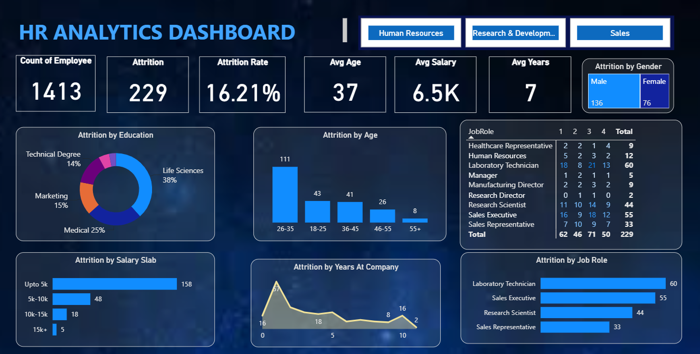

# HR Analytics Dashboard – Power BI

## 📊 Project Overview

This project is an **HR Analytics Dashboard** created using Microsoft Power BI. It analyzes employee data to understand **employee attrition, salary, age, education, job roles, gender, and years at the company**.

The dashboard provides interactive charts and KPIs to make HR data easier to understand and help identify important workforce trends.

## 🛠️ Tools & Technologies

* **Microsoft Power BI** – Dashboard and data visualization
* **Power Query** – Data cleaning and transformation
* **DAX** – Calculations and KPIs
* **Microsoft Excel** – Dataset

## 📌 Key KPIs

* **Total Employees:** 1,413
* **Total Attrition:** 229
* **Attrition Rate:** 16.21%
* **Average Age:** 37
* **Average Salary:** 6.5K
* **Average Years at Company:** 7

## 📈 Dashboard Features

The dashboard analyzes:

* Employee attrition
* Attrition by age
* Attrition by education
* Attrition by salary slab
* Attrition by job role
* Attrition by gender
* Years at company
* Employee distribution by job role
* Department-wise analysis

## 🖼️ Dashboard Preview

## 📁 Project Files

| File                        | Description               |
| --------------------------- | ------------------------- |
| `HR_Analytics_PowerBI.pbix` | Power BI dashboard        |
| `HR_Analytics_Dataset.xlsx` | Dataset used for analysis |
| `screenshots/`              | Dashboard screenshots     |

## 🎯 Project Objective

The main objective of this project is to analyze employee data and identify **patterns and trends related to employee attrition** using Power BI.

The dashboard makes the analysis interactive and helps users explore HR data through filters, KPIs, and visualizations.

## 💡 Key Skills Demonstrated

* Data Cleaning
* Data Transformation
* Data Visualization
* Power Query
* DAX
* KPI Creation
* Interactive Dashboard Design
* HR Data Analysis
